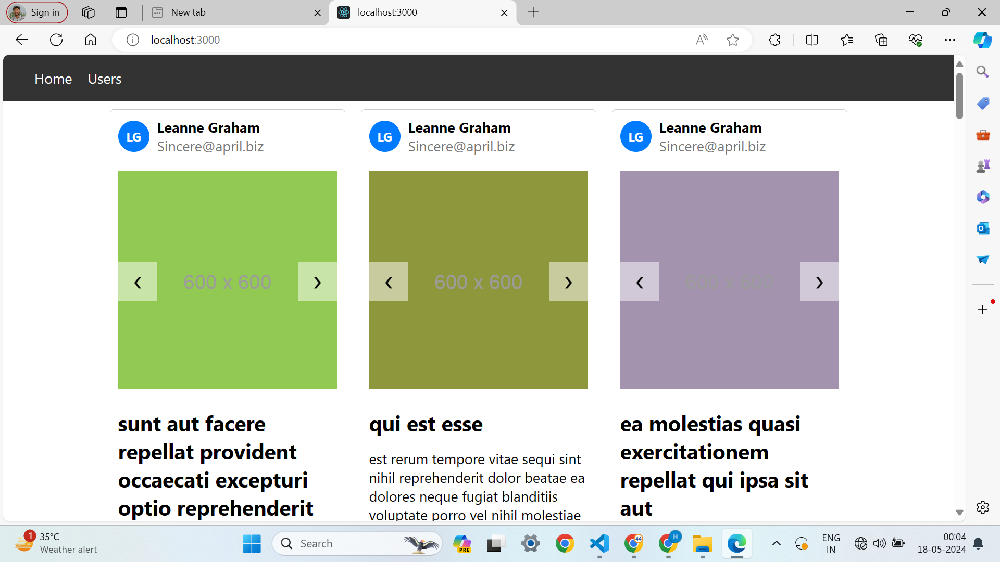

# harshpanwar_vidyalAi Assessment

## Overview
This Project includes tasks ranging from UI fixes to implementing new features and improving code structure.

## Tasks

- [1] Fix carousel scrolling UI: Improved navigation button functionality and centered them vertically relative to the image -  TaskDone✅✅
- [2] Replace dummy images by fetching each album of post using "https://jsonplaceholder.typicode.com/albums/1/photos" in /api/v1/posts route.  -  TaskDone✅✅
- [3] Make the top nav bar sticky during scrolling.  - TaskDone✅✅
- [4] Implement functionality to load more posts upon clicking the "Load More" button. Hide the button if no posts exist.  - TaskDone✅✅
- [5] Display the user's name and email in each post. Show the first letter for both the first and last names. - TaskDone✅✅
- [6] Converted UserList React class component to functional component and converted with UserData HOC to a custom React hook. - TaskDone✅✅
- [7] Converted useWindowWidth hook to ContextAPI. Declared the ContextAPI globally and accessed the isSmallerDevice property. - TaskDone✅✅

## Features Added
- Improved carousel scrolling UI with centered navigation buttons.
- Dynamic loading of post images from external API.
- Sticky top nav bar for improved navigation experience.
- Load more posts functionality to handle large datasets efficiently.
- Display of user's name and email in each post with initials.
- Converted class components to functional components and HOC to custom hooks.
- Global ContextAPI implementation for window width detection.

## Usage
1. Step-1:git clone https://github.com/Harsh-Panwar22062001/harshpanwar_vidyalai
2. Step-2:cd harshpanwar_vidyalai
3. step-3: npm install
4: step-4 : npm run dev

